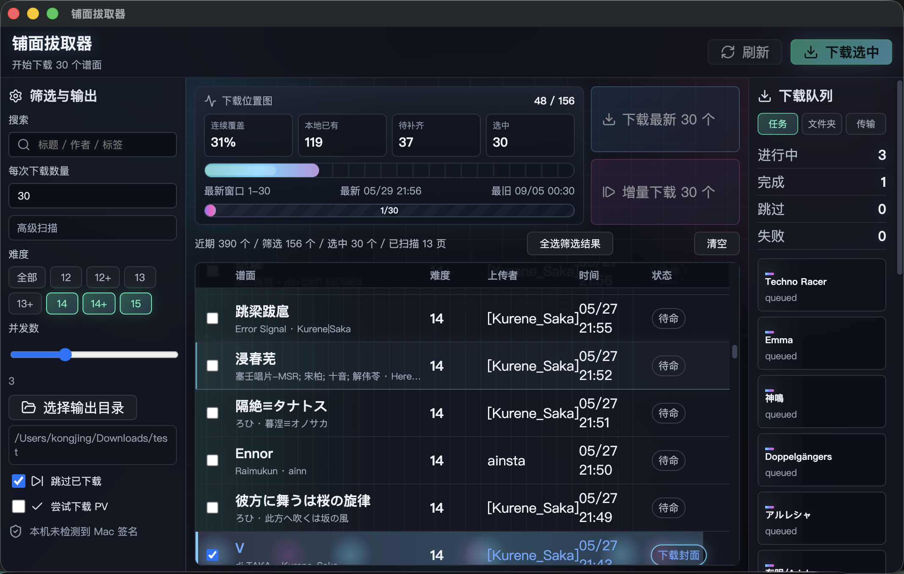

# 铺面拔取器

铺面拔取器是一个面向 MajdataNet 的桌面批量下载工具。它可以按难度和关键词筛选近期谱面，批量下载到本地文件夹，并把完整歌曲文件夹打包成 ZIP，通过局域网二维码传到 iPad。



## 核心功能

- 拉取 MajdataNet 近期谱面列表。
- 支持关键词筛选和多个难度同时筛选。
- 支持下载最新指定数量的谱面。
- 支持增量下载指定数量的谱面，自动跳过本地已有内容并继续向前扫描。
- 每个谱面保存到独立歌曲文件夹。
- 下载 `maidata.txt`、`track.mp3`、`bg.jpg`，可选尝试下载 `pv.mp4`。
- 保存 `meta.json`，用于识别已下载谱面和后续增量下载。
- 自动使用 Electron 系统网络栈，跟随系统代理。
- 支持实时刷新当前输出目录，显示完整歌曲、缺文件歌曲和总大小。
- 支持在谱面列表中直接删除已下载的本地歌曲文件夹。
- 支持打包完整歌曲文件夹为 ZIP，并开启局域网二维码下载，方便 iPad 扫码获取。

## 下载逻辑

`下载最新 X 个` 会从当前筛选结果最前面开始取 X 个。如果当前列表不够，会自动向更早页面扫描，直到满足数量或达到最大扫描页数。

`增量下载 X 个` 会从当前筛选结果最前面开始扫描，但会跳过本地已经存在的歌曲文件夹。它会继续向更早页面查找，直到找到 X 个未下载谱面或达到最大扫描页数。

左侧的 `每次下载数量` 控制两个批量按钮里的 X。`最大扫描页数` 放在高级扫描里，默认 50，通常不需要改。

## iPad 传输

选择输出目录后，右侧切到 `传输`：

1. 点击 `打包并开启扫码下载`。
2. 应用会只打包完整歌曲文件夹。
3. 传输页会显示二维码和局域网下载地址。
4. iPad 与电脑连到同一局域网后，用相机或 Safari 扫码下载 ZIP。
5. 下载完成后在 iPad 文件 App 中解压。

完整歌曲文件夹需要包含：

```text
maidata.txt
track.mp3
bg.jpg
meta.json
```

## 文件夹格式

下载后的每首歌会保存为一个独立子文件夹，命名格式为：

```text
歌曲名_谱师或上传者_日期_id
```

示例：

```text
Never Escape_海鲜杯2_20260529_abcd1234/
├── maidata.txt
├── track.mp3
├── bg.jpg
└── meta.json
```

## 本地开发

```bash
pnpm install
pnpm dev
```

## 本地构建

```bash
pnpm dist:mac
pnpm dist:win
pnpm dist:linux
```

## CI 构建

GitHub Actions 会构建：

- Windows x64
- macOS arm64
- Linux x64

macOS 构建会尝试自动发现可用的 code-signing identity。没有本机或 CI 证书时，会生成未签名包。

## 说明

局域网扫码下载需要电脑和 iPad 处在同一个网络中。如果二维码无法访问，通常是网络隔离、防火墙或设备不在同一局域网导致。
